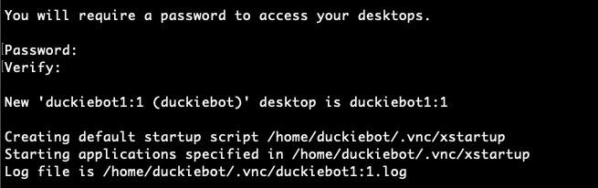
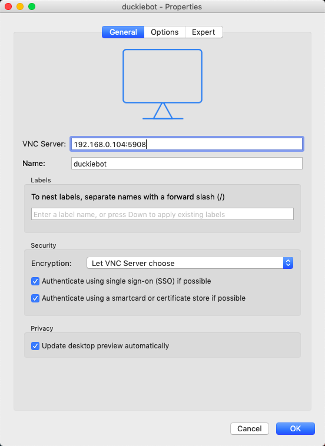
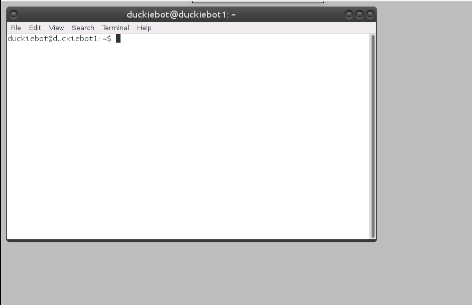
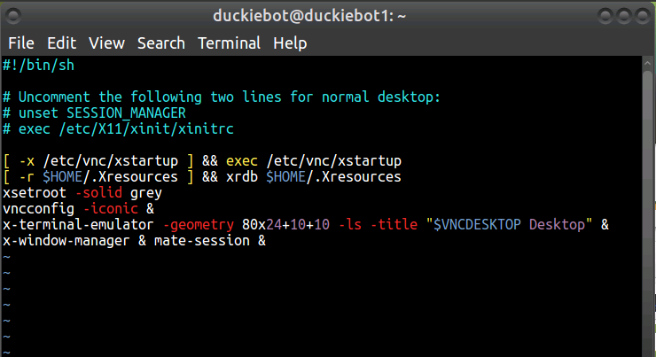
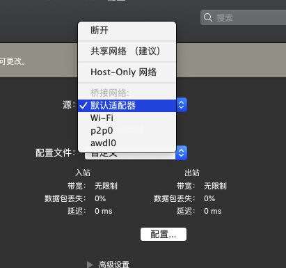
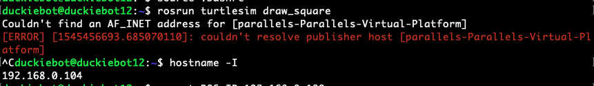
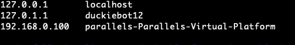

# Duckietown setup

*Peikun Guo, 2018.12*

For basic initializations, see (RTFM):

* [Official website](https://www.duckietown.org/)
* [Manual (version 2018)](https://docs.duckietown.org/DT18/opmanual_duckiebot/out/setup_duckiebot.html)

PS. The following instructions are not necessarily step-by-step, and in case your duckiebot is already well-configured, it is possible that you only have to look at few of them.

## VNC setup

**Prerequisites: ssh connection**

1. ssh [duckiebot]

2. `$ vncserver`

   And get something like this. Set the password for vnc and confirm.

   

   After this, you should be able to form a vnc connection. For example, if you open a new vnc port at 8 (`vncserver :8`) , the login `server:port` should be specified as `server:<5900+port_number>` :

   

   However, what you'll see is probably a console, not the desktop interface as we desired. The last step is to configure vnc server on the raspberry pi.

   

3.  Configure vncserver

   1. kill old sessions

      (You can do this in ssh)

   ```bash
   vncserver -kill :<port_num>
   ```

   2. modify VNC configuration file.

      

      PS: Don't follow the 'Uncomment the following lines' suggestion, the interface will look crappy.

   3. start a new session(e.g. `vncserver :2`) and you are all set.

      If a command line window pops up at the topleft corner, type 'exit' to exit.

   4. If ssh doesn't work due to startup password requirement:

      1. remove login password for current user (i.e. duckiebot)

      2. set duckiebot as autologin user:

         ```bash
         sudo vim /usr/share/lightdm/lightdm.conf.d/60-lightdm-gtk-greeter.conf
         ```

         Change the default to:

         ```bash
         [SeatDefaults]
         greeter-session=lightdm-gtk-greeter
         autologin-user=<USERNAME>
         ```


## Change the alias of your bot

* hostname

Default hostname is `duckiebot1`, which can **easily cause collision**. Modify in:

```bash
sudo vim /etc/hostname
sudo vim /etc/hosts
```

* After this, we can ssh connect by:

```bash
ssh duckiebot@duckiebot[id].local
#or ssh duckiebot@[ip_addr]
```

* Modify the `machines` file:

```bash
roscd duckietown
vim machines
```

Modify:

```html
<machine name="duckiebot1" address="duckiebot1.local" user="duckiebot" env-loader="$(arg env_script_path)"/>
```

Normally, the configuration in /etc/ will become effective instantly; if not:

```bash
# works for Ubuntu MATE
sudo /etc/init.d/networking restart
```


## ROS network configuration

vim ~/.bashrc:

```bash
# on duckiebot
ROS_HOSTNAME = [bot ip]
ROS_MASTER_URI = http://[computer_ip]:11311
```

```bash
# on your computer (master)
ROS_HOSTNAME = [computer ip]
ROS_MASTER_URI = http://[computer_ip]:11311
```

**In my case, I was using OS X 10.14 + Parallels Desktop 14 (Ubuntu 18.04, ROS Melodic).** The most annoying part is how to get ROS on Ubuntu virtual machine communicate directly with duckiebot, since **the Parallels VM and OS X practically share a same ip by default**. If you are a Windows or original Linux user, ignore the following.

* Go to Parallels settings --> network, change it to **'Bridged'**:

  

Now the VM and OS X each have an address under the same subnet, which looks perfect, and **I was too naive to think that it was the end.**

Instead, when using duckiebot as a host, you may get this error:



Solution is actually brutal (野蛮):

```bash
sudo vim /etc/hosts	
```



Change the name and ip according to your own error message.


## Validate your configuration

After all these Z-turns (折腾), test your config by:

* On computer

```bash
# on computer
roscore
# In a new terminal
rosrun turtlesim turtlesim_node
```

* On duckiebot

```bash
rosrun turtlesim draw_square
```

Ideally you should see a random-looking turtle drawing square on your Ubuntu (master) window.

* Camera:

```bash
# duckiebot
roslaunch duckietown camera.launch veh:=duckiebot12
# master
rqt_image_view
```


http://wiki.ros.org/catkin/Tutorials/create_a_workspace

http://wiki.ros.org/ROS/Tutorials/CreatingPackage

